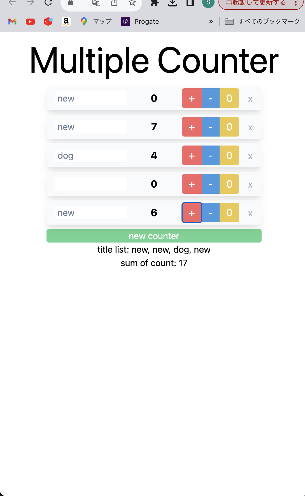

# Svelte: Multiple Counter App

## はじめに

デプロイという作業そのものが初めてでとても苦労しました。ネットの記事を見てアダプタを変更したり、amplify の設定で Base Directory を変更したりと
まさに針の穴に糸を通すような作業の末、何とかデプロイを行いました。Svelte についても扱うのが初めてだったのですが、React を学習していたこともあり、コードを俯瞰すると Svelte のおおよその全体像を掴むことができ、フロントエンドの知見を客観視するいい機会になりました。

## サンプル画像

<!-- 
 -->
  
<!-- 
 -->

## 実装機能

- **カウンター機能**: デモサイトと同様に、個別のカウンターの増減やリセットが可能。
- **複数カウンター**: カウンターの追加と削除機能。
- **カウンタータイトル設定**: 各カウンターに名前を設定。
- **合計カウント表示**: すべてのカウンター値の合計を表示。

## こだわりポイント

- **レスポンシブデザイン**: 様々なデバイスに対応したレイアウト調整。
- **tailwind**: 使い慣れた CSS フレームワークを採用。
- **tabindex**: デモサイトを参考に tabindex=-1 をボタン要素に適用し、フォーカスする要素を限定。

## 実装プロセス

- システム要件に沿ってローカルで開発。
- GitHub にホストし、AWS Amplify でデプロイ。

## おわりに

まだ素人に毛の生えたレベルのスキル、知識しかありませんが、少しでも早く力をつけたいという思いで毎日コーディングを行なっています。
